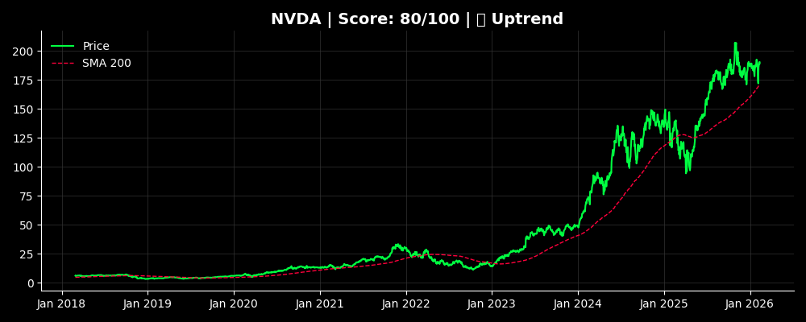
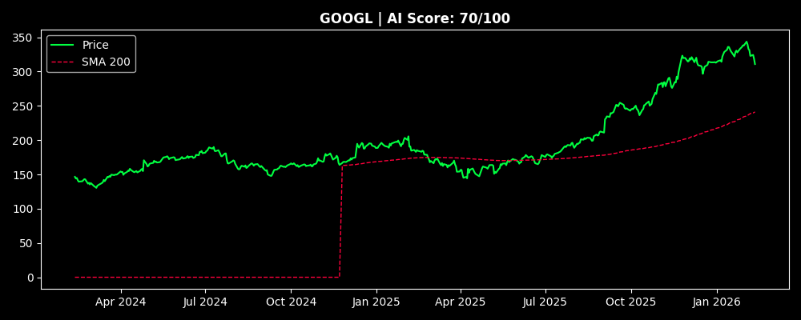
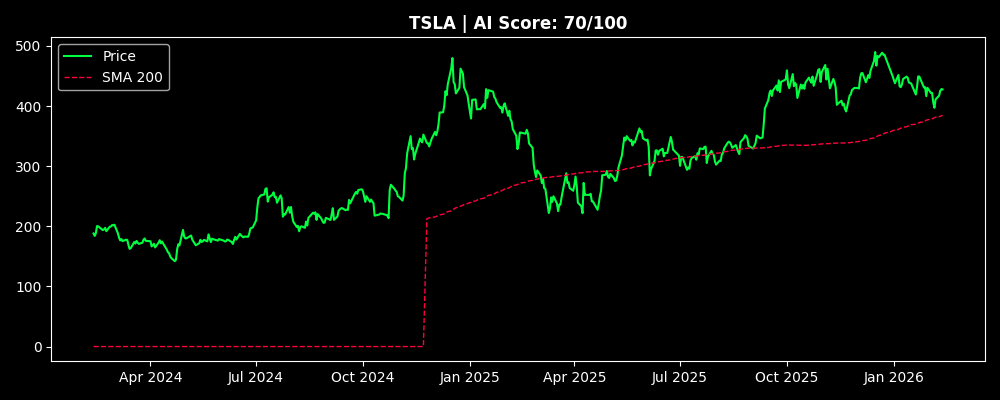

# 📊 Market AI Radar

## 🚀 [Open Live Site](https://almog787.github.io/Stock-information-/)

> Last Updated: 2026-02-12 15:38 UTC

## 🏆 Top Opportunities
### 1. NVDA (Score: 70)

### 2. GOOGL (Score: 70)

### 3. TSLA (Score: 70)

## 📋 Full Rankings
| Rank | Ticker | Price | Change | Score | Signals |
| :--: | :---: | :---: | :---: | :---: | :--- |
| 1 | **NVDA** | $190.61 | 🟢 0.29% | **70** | 📈 Uptrend |
| 2 | **GOOGL** | $311.42 | 🟢 0.15% | **70** | 📈 Uptrend |
| 3 | **TSLA** | $427.80 | 🔴 -0.11% | **70** | 📈 Uptrend |
| 4 | **BRK-B** | $505.00 | 🟢 1.00% | **70** | 📈 Uptrend |
| 5 | **LLY** | $1037.71 | 🟢 2.22% | **70** | 📈 Uptrend |
| 6 | **AVGO** | $338.25 | 🔴 -1.32% | **70** | 📈 Uptrend |
| 7 | **AAPL** | $271.67 | 🔴 -1.39% | **55** | 📈 Uptrend, 🔴 Overbought |
| 8 | **MSFT** | $401.89 | 🔴 -0.61% | **45** | 📉 Downtrend, 🟢 Oversold |
| 9 | **AMZN** | $201.07 | 🔴 -1.48% | **45** | 📉 Downtrend, 🟢 Oversold |
| 10 | **META** | $658.68 | 🔴 -1.50% | **30** | 📉 Downtrend |

## 🗄️ Database Audit
| Ticker | Records | Time Range |
| :--- | :---: | :--- |
| NVDA | 503 | `2024-02-12` to `2026-02-12` |
| GOOGL | 503 | `2024-02-12` to `2026-02-12` |
| TSLA | 503 | `2024-02-12` to `2026-02-12` |
| BRK-B | 503 | `2024-02-12` to `2026-02-12` |
| LLY | 503 | `2024-02-12` to `2026-02-12` |
| AVGO | 503 | `2024-02-12` to `2026-02-12` |
| AAPL | 503 | `2024-02-12` to `2026-02-12` |
| MSFT | 503 | `2024-02-12` to `2026-02-12` |
| AMZN | 503 | `2024-02-12` to `2026-02-12` |
| META | 503 | `2024-02-12` to `2026-02-12` |
