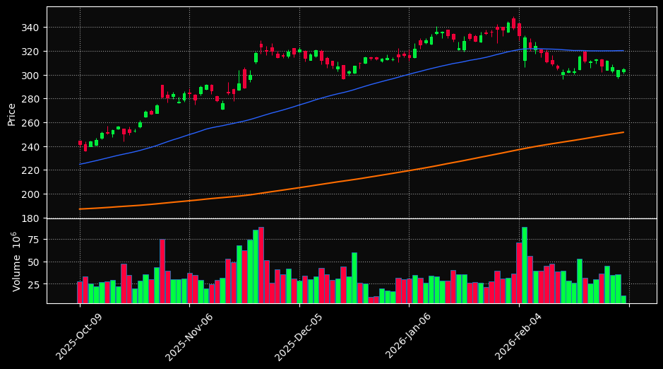
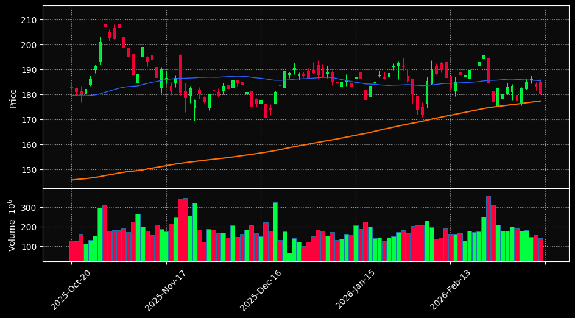
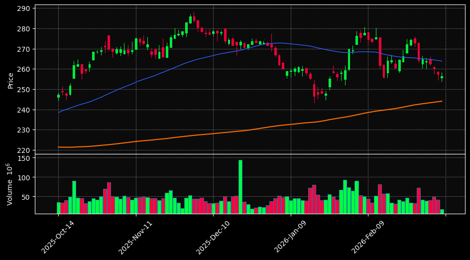

# 🧠 Institutional AI Market Radar | מודיעין שוק מבוסס בינה מלאכותית

## 🚀 [Access Interactive Web Terminal | כניסה לטרמינל האינטראקטיבי](https://almog787.github.io/Stock-information-/)

---

### 🇺🇸 English Summary
Automated technical analysis on the Top 10 US stocks. The system monitors long-term trends and momentum to generate AI-driven trade signals.

### 🇮🇱 תקציר בעברית
ניתוח טכני אוטומטי ל-10 המניות הגדולות בארה"ב. המערכת מנטרת מגמות ארוכות טווח ומומנטום כדי להפיק איתותי מסחר מבוססי בינה מלאכותית.

---

## 🏆 Top Trade Opportunities | הזדמנויות מסחר מובילות
### 1. GOOGL (AI Score: 85)
**Signals:** `📈 Uptrend, 🟢 Oversold`

### 2. NVDA (AI Score: 70)
**Signals:** `📈 Uptrend`

### 3. AAPL (AI Score: 70)
**Signals:** `📈 Uptrend`

---

## 📋 Market Rankings Table | טבלת דירוג שוק
| Rank | Symbol | Price | Change | AI Score | Trend | RSI |
| :--- | :--- | :---: | :---: | :---: | :---: | :---: |
| 1 | **GOOGL** | $310.19 | 🔴 -0.25% | **85** | 📈 Uptrend | 33.2 |
| 2 | **NVDA** | $189.17 | 🔴 -0.46% | **70** | 📈 Uptrend | 51.5 |
| 3 | **AAPL** | $261.54 | 🔴 -5.07% | **70** | 📈 Uptrend | 62.3 |
| 4 | **TSLA** | $414.48 | 🔴 -3.22% | **70** | 📈 Uptrend | 36.3 |
| 5 | **BRK-B** | $504.08 | 🟢 0.81% | **70** | 📈 Uptrend | 69.1 |
| 6 | **LLY** | $1045.08 | 🟢 2.94% | **70** | 📈 Uptrend | 47.6 |
| 7 | **AVGO** | $333.35 | 🔴 -2.75% | **70** | 📈 Uptrend | 57.3 |
| 8 | **MSFT** | $404.52 | 🟢 0.04% | **45** | 📉 Downtrend | 27.9 |
| 9 | **AMZN** | $199.31 | 🔴 -2.34% | **45** | 📉 Downtrend | 16.6 |
| 10 | **META** | $652.80 | 🔴 -2.38% | **30** | 📉 Downtrend | 48.6 |

---

## 📘 Legend & Definitions | מקרא והסברים

| Term | מונח | Description | תיאור |
| :--- | :--- | :--- | :--- |
| **AI Score** | **ציון AI** | Overall rating (0-100). >70 is Bullish, <30 is Bearish. | דירוג כללי (0-100). מעל 70 חיובי, מתחת ל-30 שלילי. |
| **RSI** | **מדד חוזק** | Below 30 = Oversold (Buy), Above 70 = Overbought (Sell). | מתחת ל-30 = מכירת יתר, מעל 70 = קניית יתר. |
| **SMA 200** | **ממוצע 200** | The orange dashed line. Primary long-term trend indicator. | הקו המקווקו הכתום. אינדיקטור מגמה ארוך טווח. |

---

## 🗄️ Database Audit | ביקורת מאגר הנתונים
| Ticker | Records | Date Range | File Size | Status |
| :--- | :---: | :--- | :---: | :---: |
| AAPL | 2000 | `2018-02-28` to `2026-02-11` | 430.3 KB | ✅ Sync |
| TSLA | 2000 | `2018-02-28` to `2026-02-11` | 424.9 KB | ✅ Sync |
| AVGO | 2000 | `2018-02-28` to `2026-02-11` | 428.7 KB | ✅ Sync |
| BRK-B | 2000 | `2018-02-28` to `2026-02-11` | 418.8 KB | ✅ Sync |
| GOOGL | 2000 | `2018-02-28` to `2026-02-11` | 428.8 KB | ✅ Sync |
| MSFT | 2000 | `2018-02-28` to `2026-02-11` | 428.5 KB | ✅ Sync |
| LLY | 2000 | `2018-02-28` to `2026-02-11` | 424.8 KB | ✅ Sync |
| META | 2000 | `2018-02-28` to `2026-02-11` | 428.1 KB | ✅ Sync |
| NVDA | 2000 | `2018-02-28` to `2026-02-11` | 430.9 KB | ✅ Sync |
| AMZN | 2000 | `2018-02-28` to `2026-02-11` | 422.8 KB | ✅ Sync |
| META | 503 | `2024-02-12` to `2026-02-12` | 63.7 KB | ✅ Sync |
| TSLA | 503 | `2024-02-12` to `2026-02-12` | 64.5 KB | ✅ Sync |
| NVDA | 503 | `2024-02-12` to `2026-02-12` | 65.4 KB | ✅ Sync |
| AVGO | 503 | `2024-02-12` to `2026-02-12` | 64.7 KB | ✅ Sync |
| AAPL | 503 | `2024-02-12` to `2026-02-12` | 64.8 KB | ✅ Sync |
| AMZN | 503 | `2024-02-12` to `2026-02-12` | 64.6 KB | ✅ Sync |
| MSFT | 503 | `2024-02-12` to `2026-02-12` | 64.3 KB | ✅ Sync |
| LLY | 503 | `2024-02-12` to `2026-02-12` | 63.3 KB | ✅ Sync |
| GOOGL | 503 | `2024-02-12` to `2026-02-12` | 64.8 KB | ✅ Sync |
| BRK-B | 503 | `2024-02-12` to `2026-02-12` | 63.7 KB | ✅ Sync |

---
*Automated system powered by Python & GitHub Actions. Last Sync: 2026-02-12 19:33 UTC*