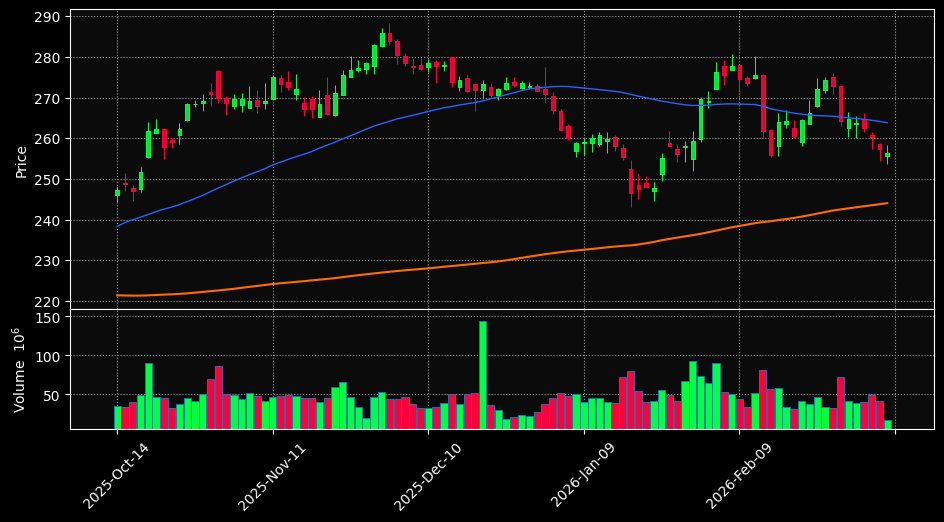
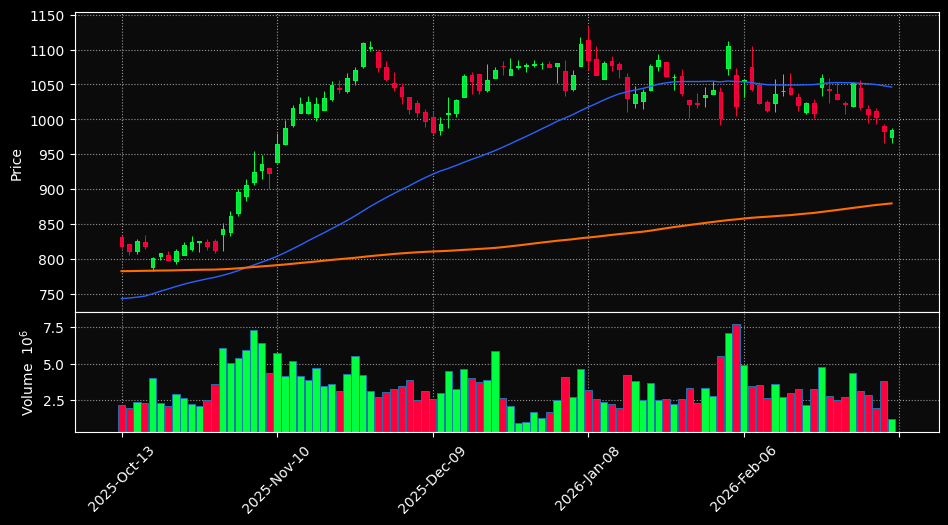
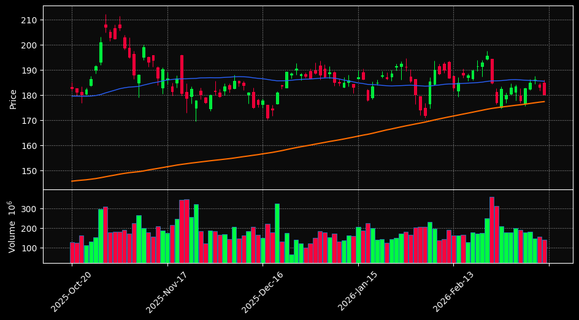
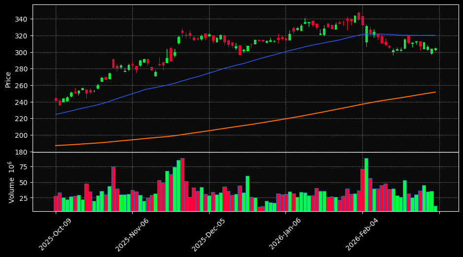
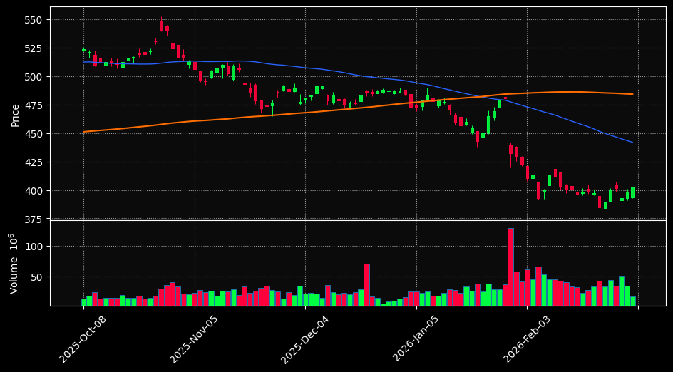
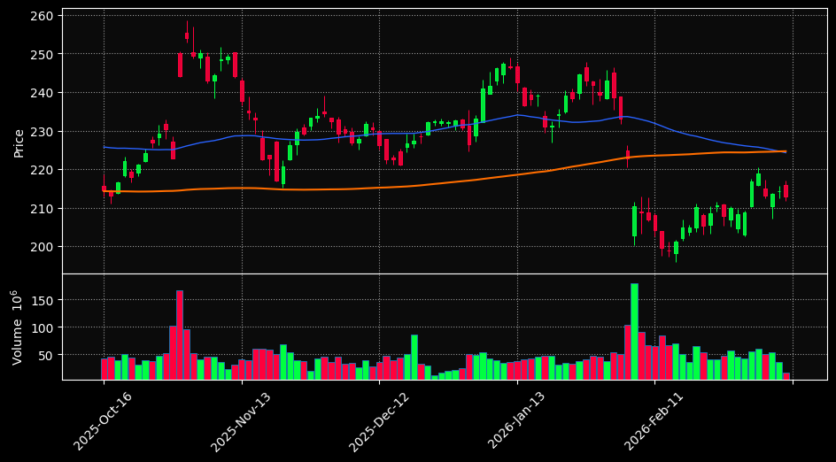
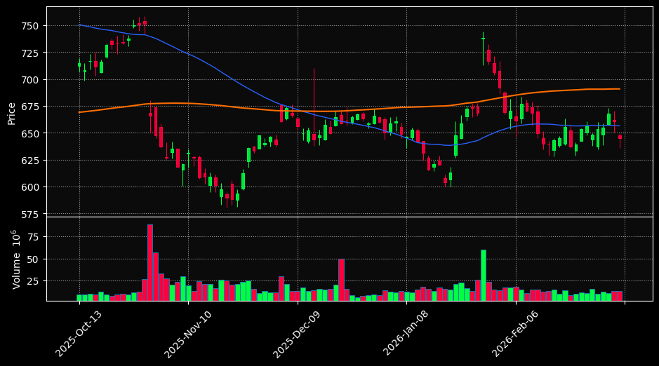
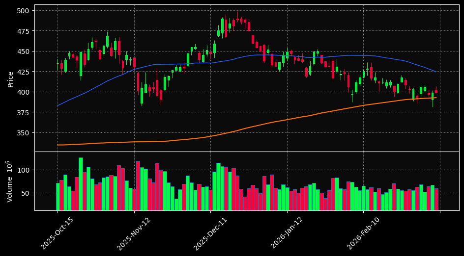
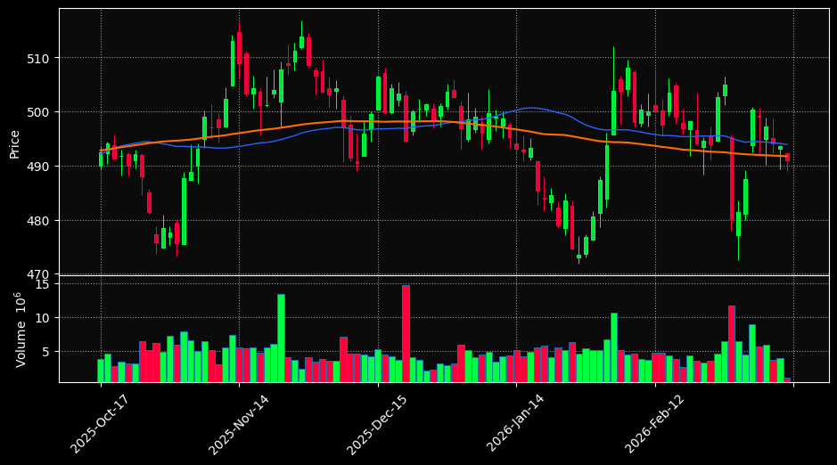
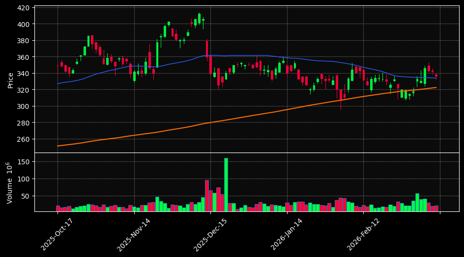

# 🧠 Institutional AI Market Radar | מודיעין שוק מבוסס AI

## 🚀 [Open Interactive Terminal | כניסה לטרמינל האינטראקטיבי](https://almog787.github.io/Stock-information-/)

---

## 📈 Market Analysis Gallery | גלריית ניתוח שוק
*גרפים עבור כל המניות במעקב (100 ימי מסחר אחרונים)*

### 1. AAPL (AI Score: 85)
**Signals:** `📈 Uptrend, 🟢 Oversold` | **איתותים:** `📈 מגמת עלייה, 🟢 מכירת יתר`

---
### 2. LLY (AI Score: 85)
**Signals:** `📈 Uptrend, 🟢 Oversold` | **איתותים:** `📈 מגמת עלייה, 🟢 מכירת יתר`

---
### 3. NVDA (AI Score: 70)
**Signals:** `📈 Uptrend` | **איתותים:** `📈 מגמת עלייה`

---
### 4. GOOGL (AI Score: 70)
**Signals:** `📈 Uptrend` | **איתותים:** `📈 מגמת עלייה`

---
### 5. MSFT (AI Score: 30)
**Signals:** `📉 Downtrend` | **איתותים:** `📉 מגמת ירידה`

---
### 6. AMZN (AI Score: 30)
**Signals:** `📉 Downtrend` | **איתותים:** `📉 מגמת ירידה`

---
### 7. META (AI Score: 30)
**Signals:** `📉 Downtrend` | **איתותים:** `📉 מגמת ירידה`

---
### 8. TSLA (AI Score: 30)
**Signals:** `📉 Downtrend` | **איתותים:** `📉 מגמת ירידה`

---
### 9. BRK-B (AI Score: 30)
**Signals:** `📉 Downtrend` | **איתותים:** `📉 מגמת ירידה`

---
### 10. AVGO (AI Score: 30)
**Signals:** `📉 Downtrend` | **איתותים:** `📉 מגמת ירידה`

---

## 📋 Rankings Summary Table | טבלת דירוג מרוכזת
| Rank | Symbol | Price | Change | AI Score | RSI |
| :--- | :--- | :---: | :---: | :---: | :---: |
| 1 | **AAPL** | $251.54 | 🔴 -1.65% | **85** | 31.0 |
| 2 | **LLY** | $991.00 | 🟢 1.41% | **85** | 33.5 |
| 3 | **NVDA** | $180.68 | 🔴 -1.34% | **70** | 39.7 |
| 4 | **GOOGL** | $300.87 | 🔴 -0.88% | **70** | 38.2 |
| 5 | **MSFT** | $395.43 | 🔴 -1.60% | **30** | 59.1 |
| 6 | **AMZN** | $206.59 | 🔴 -1.40% | **30** | 51.8 |
| 7 | **META** | $610.67 | 🔴 -4.31% | **30** | 39.4 |
| 8 | **TSLA** | $393.28 | 🔴 -0.44% | **30** | 46.5 |
| 9 | **BRK-B** | $490.15 | 🔴 -0.35% | **30** | 47.1 |
| 10 | **AVGO** | $322.54 | 🔴 -4.00% | **30** | 45.7 |

---
## 📘 Legend & Definitions | מקרא והסברים

| Term | מונח | Description | תיאור |
| :--- | :--- | :--- | :--- |
| **AI Score** | **ציון AI** | Quality rating (0-100). | דירוג איכות כללי (0-100). |
| **SMA 200** | **ממוצע 200** | Orange line. Long-term trend. | קו כתום. מגמה ארוכת טווח. |
| **RSI** | **מדד חוזק** | Momentum indicator (30-70 range). | מדד מומנטום (טווח 30-70). |

---
## 🗄️ Database Audit | ביקורת נתונים
| Ticker | Records | Time Range | Status |
| :--- | :---: | :--- | :---: |
| AAPL | 11404 | `1980-12-12` - `2026-03-13` | ✅ Verified |
| LLY | 13558 | `1972-06-01` - `2026-03-13` | ✅ Verified |
| NVDA | 6827 | `1999-01-22` - `2026-03-13` | ✅ Verified |
| GOOGL | 5426 | `2004-08-19` - `2026-03-13` | ✅ Verified |
| MSFT | 10078 | `1986-03-13` - `2026-03-13` | ✅ Verified |
| AMZN | 7252 | `1997-05-15` - `2026-03-13` | ✅ Verified |
| META | 3474 | `2012-05-18` - `2026-03-13` | ✅ Verified |
| TSLA | 3951 | `2010-06-29` - `2026-03-13` | ✅ Verified |
| BRK-B | 7509 | `1996-05-09` - `2026-03-13` | ✅ Verified |
| AVGO | 4176 | `2009-08-06` - `2026-03-13` | ✅ Verified |

---
*Auto-generated by GitHub Actions using Python & yfinance. Last sync: 2026-03-13 17:52 UTC*